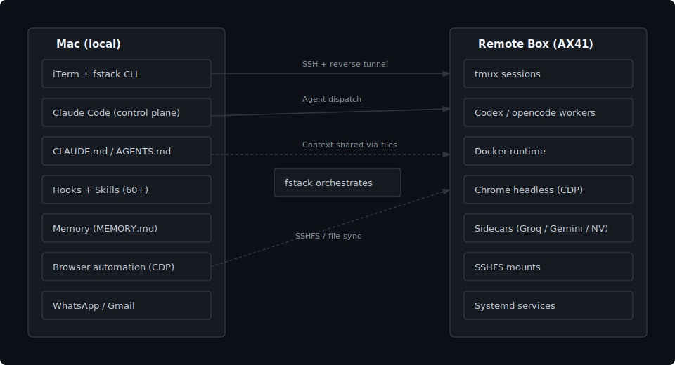

# fstack 🛵

### A terminal IDE for AI agents, extracted from 500+ real sessions

[](LICENSE)
[](https://docs.anthropic.com/en/docs/claude-code)

`fstack` is Floom's terminal IDE for AI agents: Claude as the control plane, Codex for backend/infra/debugging, opencode as an optional worker, subagent workflows, Docker-first runtime, CLAUDE.md / AGENTS.md-style context, safety hooks, 60+ skills, Gmail/WhatsApp integrations, memory, browser automation, and cost tracking.

Formerly floomhq/moto and earlier buildingopen/moto. Old GitHub URLs redirect.

<p align="center">
  
  <br>
  <em>A safety hook firing on a destructive command. Hero GIF coming soon.</em>
</p>

---

## Who is this for?

- **Founders/operators** turning repeated work into software with agents
- **Claude Code / Codex users** who want a real operating environment instead of one-off prompts
- **Terminal-first builders** running multiple agents on a Mac + remote Linux box
- **Teams** standardizing agent rules, hooks, skills, memory, and remote runtime
- **Anyone burned** by agents running destructive commands, leaking secrets, or claiming success without fresh evidence

## What makes this different?

Most AI coding setups are a prompt file plus a pile of tools. `fstack` is the full operating environment: context, hooks, skills, memory, terminal sessions, remote server runtime, browser automation, Docker sandboxes, and launcher commands for Claude, Codex, and opencode.

The philosophy is simple:

- context before prompting
- wireframes before UI code
- Docker before SaaS integrations
- subagents before monolithic chats
- cheap models for mechanical checks
- expensive models for judgment
- complexity only after real usage earns it

---

## Quick Start

```bash
git clone https://github.com/floomhq/fstack.git
cd fstack
./install.sh          # Symlinks configs into ~/.claude/
```

That's it. The installer detects existing configs, backs them up, resolves `$HOME` paths in hook commands, and installs 17 hooks + 7 scripts + 60+ skills + memory template. Run `./install.sh --copy` for standalone files instead of symlinks.

For the full remote workstation from the same repo:

```bash
cp .env.example .env
$EDITOR .env
./install.sh mac
./install.sh server-remote
```

**After install:**
1. Edit `~/.claude/CLAUDE.md` to match your workflow (search for `<!-- Customize -->` comments)
2. Copy `claude/CLAUDE-project.md` into your project roots
3. Optionally copy `.env.example` to `.env` for API keys used by some hooks/scripts

---

## Comparison

|  | bare Claude Code | Claude Code + dotfiles | **fstack** |
|---|---|---|---|
| Context | manual per session | static files | CLAUDE.md + AGENTS.md + MEMORY.md |
| Safety | none | none | **17 hooks** blocking destructive commands, secret leaks, config tampering |
| Remote workflow | DIY SSH | DIY SSH | **`fstack up`** + SSHFS + systemd + tmux |
| Skills | none | none | **60+ slash commands** (/cost, /qa, /ship, /debug, etc.) |
| Sidecars | none | none | **Groq / Gemini / NVIDIA** routing for cheap stateless work |
| Memory | none | none | **MEMORY.md** auto-updated across sessions |
| Cost tracking | none | none | **Per-model, per-session** token costs |
| Browser | none | none | **Chrome CDP** automation via skills |
| Messaging | none | none | **WhatsApp + Gmail** integrations |

---

## Architecture

<p align="center">
  
</p>

`fstack` treats your Mac as the control plane and a remote Linux box as the runtime. Claude Code orchestrates; Codex/opencode handle heavy lifting; Docker sandboxes risky work; sidecars review cheaply; hooks enforce safety at every tool call.

Read the deep dive: [`docs/architecture.md`](docs/architecture.md)

---

## What's included

| Directory | Contents | Learn more |
|-----------|----------|------------|
| [`claude/`](claude/) | CLAUDE.md, hooks, scripts, skills, memory | [`claude/skills/README.md`](claude/skills/README.md) · [`claude/hooks/README.md`](claude/hooks/README.md) · [`claude/memory/README.md`](claude/memory/README.md) |
| [`mac/`](mac/) | `fstack` CLI, iTerm automation, shell aliases, launchd + SSH templates | [`mac/README.md`](mac/README.md) |
| [`server/`](server/) | Systemd services, Docker stack, safety utils, browser automation, tmux | [`docs/bootstrap.md`](docs/bootstrap.md) |
| [`whatsapp/`](whatsapp/) | OpenClaw gateway, verified send, SQLite contact lookup | [`whatsapp/README.md`](whatsapp/README.md) |
| [`gmail/`](gmail/) | IMAP checker, multi-account support | [`gmail/`](gmail/) |
| [`cron/`](cron/) | Job templates, health checks, safe-pipeline patterns | [`cron/`](cron/) |

---

## FAQ

**Do I need a remote server?**
No. `./install.sh` works locally. Add `./install.sh mac` + `./install.sh server-remote` only when you want the integrated remote workflow.

**Does this replace Claude Code?**
No. It's the operating environment around Claude Code (and Codex, and opencode). You still use Anthropic's CLI; fstack just makes it reliable, safe, and reproducible.

**Is this safe?**
17 hooks run on every tool call blocking `rm -rf /`, secret leaks, wrong package managers, unverified WhatsApp sends, and more. See [`claude/hooks/README.md`](claude/hooks/README.md).

**How much does it cost?**
The repo is free. Hooks track your Claude/Codex token spend to `costs.jsonl`. Sidecars route bounded work to free/cheap models so you burn premium tokens on judgment, not mechanical tasks.

**Can I use only the hooks? Or only the skills?**
Yes. The installer is modular. Pick what you need.

---

## Requirements

| Requirement | Required? | Used by |
|-------------|-----------|---------|
| [Claude Code CLI](https://docs.anthropic.com/en/docs/claude-code) | Yes | Everything |
| `jq` | Yes | All hooks (JSON parsing) |
| `python3` | Optional | Gemini audit hook, email checker |
| `gitleaks` | Optional | Secret scanning hook |

---

## Configuration

After running `install.sh`:

1. **Edit CLAUDE.md** — Search for `<!-- Customize -->` comments and replace placeholders with your setup
2. **Add project configs** — Copy `claude/CLAUDE-project.md` to each project root
3. **API keys** (optional) — Copy `.env.example` to `.env` for hooks/scripts that need external APIs

The `settings.json` file has `$HOME` paths pre-resolved by the installer. Re-run `./install.sh` to pick up changes.

---

## Related Projects

Other open-source tools from BuildingOpen:

| Project | Description |
|---------|-------------|
| **[bouncer](https://github.com/buildingopen/bouncer)** | Independent Gemini quality gate that audits Claude Code's output before it can stop |
| **[claude-code-stats](https://github.com/buildingopen/claude-code-stats)** | Spotify Wrapped for Claude Code. Visualize your AI coding stats, token usage, and costs |
| **[claude-wrapped](https://github.com/buildingopen/claude-wrapped)** | Visualize your Claude Code stats with `npx claude-entropy` |
| **[hook-stats](https://github.com/buildingopen/hook-stats)** | Analyze your Claude Code bash command log |
| **[session-recall](https://github.com/buildingopen/session-recall)** | Search and recover context after Claude's automatic compaction |
| **[browse](https://github.com/buildingopen/browse)** | Browser automation CLI with autonomous agent mode via CDP |
| **[openbrowser](https://github.com/buildingopen/openbrowser)** | Give AI your browser. Check email, track orders, download receipts. MCP server + CLI |
| **[openqueen](https://github.com/buildingopen/openqueen)** | Autonomous coding agent controlled by WhatsApp/Telegram. Gemini orchestrates Claude/Codex |
| **[blast-radius](https://github.com/buildingopen/blast-radius)** | Find all files affected by your changes. One bash script, zero dependencies |
| **[dep-check](https://github.com/buildingopen/dep-check)** | Find dead imports in your project. One bash script |

---

## Changelog

See [CHANGELOG.md](CHANGELOG.md).

---

## License

[MIT](LICENSE)
